# OpenNeuro GLM Fitlins

**Maintainer**: Michael Demidenko  
**Contact**: [demidenko.michael@gmail.com](mailto:demidenko.michael@gmail.com)

*This repository is in active development. `Last updated: 2025-04-03`*

## Overview

`openneuro_glmfitlins` provides a streamlined workflow for analyzing OpenNeuro datasets using [FitLins](https://github.com/poldracklab/fitlins) via [BIDS Stats Models](https://bids-standard.github.io/stats-models/). The repository generates comprehensive reports for datasets and tasks processed through OpenNeuro GLM Fitlins, with two primary goals:

1. Facilitate efficient and reproducible neuroimaging data analysis
2. Provide minimal barriers to entry for researchers at all levels

## Features

- **Automatic Environment Setup**: Uses [setup_uv.sh](setup_uv.sh) to install [uv](https://docs.astral.sh/uv/guides/install-python/) Python package manager, verify dependencies (GitHub, DataLad, git-annex), and create an environment with required packages
- **Automated Data Retrieval**: Leverages DataLad and AWS CLI to clone BIDS input data and download fMRIPrep preprocessed MRI/fMRI data, automatically determining preprocessing completeness
- **Flexible Analysis Configuration**: Generates summaries of relevant subject, run, and task fMRI data to facilitate statistical model creation
- **Reproducible Environments**: Ensures computational reproducibility through `uv` environment and exported specification files
- **HPC Integration**: Simplifies recomputation of minimally preprocessed MRI data and FitLins modeling on high-performance computing clusters
- **Comprehensive Reporting**: Generates detailed summary reports at both individual and group levels, including event details, model specifications, contrasts, regressors, Variable Inflation Factors, and group-statistical z-score maps

## Repository Structure

- `scripts/`: Core scripts for the complete workflow
   - `./scripts/cluster_jobs/`: Templates for fMRIPrep, fitlins, and [pilot] nilearn jobs on HPC clusters
   - `./scripts/prep_report_py/`: Python scripts and JSON files for the workflow steps. Users typically only need to modify:
     - `modify_events.py`: For preprocessing events files
     - `file_exclusions.json`: To limit fMRIPrep derivatives download size

- `statsmodel_specs/`: JSON files defining statistical models for each OpenNeuro study, including MRIQC summaries and README files
- `LICENSE`: MIT License
- `path_config.json`: Configuration file for directory paths

## Prerequisites

- **System Dependencies**:
  - [AWS CLI](https://docs.aws.amazon.com/cli/latest/userguide/install-cliv2.html)
  - [DataLad](https://www.datalad.org/) (≥ 0.16.0)
  - Git (≥ 2.2)

- **Python Dependencies**:
  - Python 3.12+
  - Major packages:
    - numpy (≥ 1.26.0)
    - pandas (≥ 2.0.0)
    - nilearn (≥ 0.9.2)
    - matplotlib (≥ 3.7.0)
    - seaborn (≥ 0.12.0)
    - jupyter ecosystem (nbformat, IPython, notebook)
    - awscli, scipy, argparse
  - Custom installations to resolve compatibility issues:
    - fitlins: `git+https://github.com/jmumford/fitlins.git@paddedint`
    - pybids: `git+https://github.com/bids-standard/pybids.git`

## Installation & Usage



1. **Clone the repository**:
   ```bash
   git clone git@github.com:demidenm/openneuro_glmfitlins.git
   ```

2. **Set up environment**:
   ```bash
   bash setup_uv.sh
   ```

3. **Configure paths** in `path_config.json`:
   - `datasets_folder`: Location for BIDS, fMRIPrep, and analyses data
   - `openneuro_glmrepo`: Path to the cloned repository
   - `tmp_folder`: Temporary/scratch space for FitLins processing
   - `fmriprep_simg`: Singularity image for fMRIPrep
   - `freesurfer_license`: Path to Freesurfer license file

## Analysis Workflow

### 1. Download OpenNeuro Data

```bash
cd openneuro_glmfitlins/scripts/
bash 1_download_data_create_details.sh ds003425
```

This step:
- Downloads the dataset and fMRIPrep derivatives
- Shows the size of the fMRIPrep directory for confirmation (download size can be reduced via `file_exclusions.json`)
- Determines if preprocessed MNI NIfTI files are present to identify minimal vs. complete derivatives
- Generates:
  - A README summarizing the dataset
    - Note: at the base of the README ([example](./statsmodel_specs/ds003425/README.md)), there will be links to the plotted distributions of [structural](https://mriqc.readthedocs.io/en/latest/iqms/t1w.html) and [functioanl](https://mriqc.readthedocs.io/en/latest/iqms/bold.html) MRIQC quality control metrics.
  - A details JSON file with metadata (subjects, sessions, tasks, BOLD volumes, event columns, trial types)
  - Subject and contrast list files for each task

### 2. Regenerate preprocessed fMRIPrep derivatives 

***ONLY if fMRIPrep derivatives == minimal***

Within the `cluster_jobs` subfolder, submit the job with the OpenNeuro IDNote: Update your SBATCH specific information (e.g. `-p`, `--mail-user` and `--time` for larger datasets and `--array` that matches your subject array (particularly if subject IDs are not numeric))

```bash
sbatch recreate_fmriprep.sh ds003425
```

### 3. Modify Events/BOLD/Confound Files

```bash
bash 2_modify_boldeventfiles.sh ds003425 learning
```

This step:
- Trims initial volumes from preprocessed BOLD data and confound files if calibration/dummy volumes exist
- Modifies events files if needed based on the `preproc_events` flag in the details JSON
- The modified BOLD and/confounds files are saved to `derivatives_alt` fMRIPrep subfolder. Associated `.json` files are moved, too, that provided important metadata for FitLins.

**Important**: For event preprocessing, you must create a study-specific function in `modify_events.py`. Example:

```python
def ds003425(eventspath: str, task: str):
    """
    Custom function to modify events files for ds003425
    """
    if task in ["learning", "prelearning", "regulate"]:
        eventsdat = pd.read_csv(eventspath, sep='\t')
        
        # Check if trial_type 6 exists. Avoid rerunning if exists
        if 6 not in eventsdat['trial_type'].values:
            # Add trial_type 6 events based on first and last occurrences of types 4 and 5
            filtered_events = eventsdat[eventsdat['trial_type'].isin([4, 5])]
            if not filtered_events.empty:
                first_and_last_events = filtered_events.iloc[[0, -1]].copy()
                first_and_last_events['trial_type'] = 6
                eventsdat = pd.concat([eventsdat, first_and_last_events], ignore_index=True)
                eventsdat.to_csv(eventspath, sep='\t', index=False)
                print(f"Modified events file for {os.path.basename(eventspath)}")
  
        return eventsdat
```

### 4. Create Model Specification File

```bash
bash 3_create_spec_file.sh ds003425 learning
```

This step:
- Creates a BIDS Stats Models specification (e.g. spec for [ds003425_task-learning](./statsmodel_specs/ds003425/ds003425-learning_specs.json)) file based on the task, subjects, and contrasts
- Generates a template that should be reviewed and potentially modified before running FitLins
- Customizations might include changing transformations, adding temporal derivatives, or removing processing nodes

### 5. Run FitLins Model

#### 5a. On Local Machine

```bash
bash 4_run_fitlins.sh ds003425 learning
```

#### 5b. On HPC cluster

Within the `cluster_jobs` subfolder, submit the job with the OpenNeuro ID and the task name. Note: Update your SBATCH specific information (e.g. `-p`, `--mail-user` and `--time` for larger datasets)

```bash
sbatch run_fitlins.sh ds003425 learning
```

This executes the FitLins analysis based on the specification file. Results will be stored in `./data/analyses/<studyID>_task-<taskname>`.

### 6. Generate Aggregate Report for Study Task (optional)

```bash
bash run_grouprepo.sh ds003425 learning
```

This executes a command that will return images and README file based on your study details and task-specific specification and Fitlins output. Similar to [ds003425 regulate task](./statsmodel_specs/ds003425/group_regulate/), you'll obtain model, regressor and contrast maps.


## License

This project is licensed under the MIT License. See the LICENSE file for details.

## Fitslins: Most Common Sources of Errors

Before running fitlins, based on you grouping structure of nodes, ensure files are present. The below returns unique combinations of the "run" and "subject" columns. So for each run 1, subjects 1 - 13, run 2, subjects 1 - 13. If files are missing for certain cells, the workflow will fail.

```python
"GroupBy": [
        "run",
        "subject"
      ]
```

1. Imbalance in files across subjects for BOLD and/or events files (e.g., ds003425 ses-02 regulate task runs). Incorrect model spec files. Fitslins utilizes a groupby() across subjects / task / runs. 
2. Differences in runs across subjects for BOLD and/or events files (e.g., ds003425 ses-02 regulate task runs). 

However, by using `--drop-missing` flag in the Fitlins call (default in this repo), if a subject is missing a run or contrast the models will still be estimated. However, if a subject is missing all values in a contrast matrices or all runs, the computation will fail with an error.  


