# ds000105: objectviewing Task Analysis Report

The size of the Fitlins Derivatives for ds000105 objectviewing is 29G with 17276 files.

## Statistical Analysis Boilerplate

### First-level Analysis
FitLins was employed to estimate task-related BOLD activity in the objectviewing task for 6 subjects. In this instance, FitLins used the Nilearn estimator in its statistical modeling of the BOLD data. For each participant, 8 regressors of interest (out of total 9 regressors; see list below) were convolved with a spm hemodynamic response function in Nilearn. The design matrix incorporated both regressors of interest and 27 additional components, including a drift cosine basis set and nuisance regressors to account for sources of noise in the BOLD signal. Following Nilearn's *FirstLevelModel* default procedure, each voxel's timeseries was mean-scaled by each voxel's mean of the timeseries. Data were smoothed at each run using a 5mm full-width at half maximum smoothing kernal (default: isotropic additive smoothing). From the resulting model, 36 distinct contrast estimates were computed (see list below).

### Model Outputs
For each participant's run, outputs include but are not limited to:
- A complete design matrix visualization
- Model fit statistics (R-squared and log-likelihood maps)
- For each contrast: effect size maps (beta values), t-statistic maps, z-statistic maps and variance maps

An example design matrix and contrast weight specifications are provided below.

### Group-level Analysis
Within-subject runs were combined using Nilearn's *compute_fixed_effects* function (without precision weighting; `precision_weighted=False`). These subject-level average statistical maps were then entered into a group-level analysis using a two-sided one-sample t-test to estimate average univariate activation patterns.

## Additional Analysis Details 
### Regressors of Interest
trial_type.bottle, trial_type.cat, trial_type.chair, trial_type.face, trial_type.house, trial_type.scissors, trial_type.scrambledpix, trial_type.shoe, intercept
#### Convolved Regressors
trial_type.bottle, trial_type.cat, trial_type.chair, trial_type.face, trial_type.house, trial_type.scissors, trial_type.scrambledpix, trial_type.shoe
### Nuisance Regressors
trans_x, trans_x_derivative1, trans_x_derivative1_power2, trans_x_power2, trans_y, trans_y_derivative1, trans_y_derivative1_power2, trans_y_power2, trans_z, trans_z_derivative1, trans_z_derivative1_power2, trans_z_power2, rot_x, rot_x_derivative1, rot_x_derivative1_power2, rot_x_power2, rot_y, rot_y_derivative1, rot_y_derivative1_power2, rot_y_power2, rot_z, rot_z_derivative1, rot_z_derivative1_power2, rot_z_power2, cosine00, cosine01, cosine02
## Model Structure
- Run-level models: Yes
- Subject-level models: Yes

## Contrasts of Interest
- **shoe**: 1*`trial_type.shoe`
- **house**: 1*`trial_type.house`
- **chair**: 1*`trial_type.chair`
- **cat**: 1*`trial_type.cat`
- **face**: 1*`trial_type.face`
- **scrambledpix**: 1*`trial_type.scrambledpix`
- **bottle**: 1*`trial_type.bottle`
- **scissors**: 1*`trial_type.scissors`
- **shoevscrambpix**: 1*`trial_type.shoe` - 1*`trial_type.scrambledpix`
- **housevscrambpix**: 1*`trial_type.house` - 1*`trial_type.scrambledpix`
- **chairvscrambdpix**: 1*`trial_type.chair` - 1*`trial_type.scrambledpix`
- **catvscrambpix**: 1*`trial_type.cat` - 1*`trial_type.scrambledpix`
- **facevscrambpix**: 1*`trial_type.face` - 1*`trial_type.scrambledpix`
- **bottlevscrambpix**: 1*`trial_type.bottle` - 1*`trial_type.scrambledpix`
- **scissorsvscrambpix**: 1*`trial_type.scissors` - 1*`trial_type.scrambledpix`
- **shoevhouse**: 1*`trial_type.shoe` - 1*`trial_type.house`
- **shoevchair**: 1*`trial_type.shoe` - 1*`trial_type.chair`
- **shoevcat**: 1*`trial_type.shoe` - 1*`trial_type.cat`
- **shoevface**: 1*`trial_type.shoe` - 1*`trial_type.face`
- **shoevbottle**: 1*`trial_type.shoe` - 1*`trial_type.bottle`
- **shoevsscissors**: 1*`trial_type.shoe` - 1*`trial_type.scissors`
- **housevchair**: 1*`trial_type.house` - 1*`trial_type.chair`
- **housevcat**: 1*`trial_type.house` - 1*`trial_type.cat`
- **housevface**: 1*`trial_type.house` - 1*`trial_type.face`
- **housevbottle**: 1*`trial_type.house` - 1*`trial_type.bottle`
- **housevsscissors**: 1*`trial_type.house` - 1*`trial_type.scissors`
- **chairvcat**: 1*`trial_type.chair` - 1*`trial_type.cat`
- **chairvface**: 1*`trial_type.chair` - 1*`trial_type.face`
- **chairvbottle**: 1*`trial_type.chair` - 1*`trial_type.bottle`
- **chairvsscissors**: 1*`trial_type.chair` - 1*`trial_type.scissors`
- **catvface**: 1*`trial_type.cat` - 1*`trial_type.face`
- **catvbottle**: 1*`trial_type.cat` - 1*`trial_type.bottle`
- **catvsscissors**: 1*`trial_type.cat` - 1*`trial_type.scissors`
- **facevbottle**: 1*`trial_type.face` - 1*`trial_type.bottle`
- **facevsscissors**: 1*`trial_type.face` - 1*`trial_type.scissors`
- **bottlevsscissors**: 1*`trial_type.bottle` - 1*`trial_type.scissors`

## Figures

### Contrast Weights
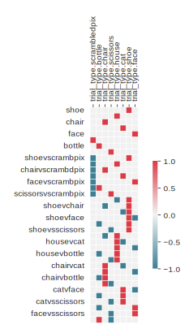

The contrast maps represents the weights used to model brain activity.

### Design Matrix

The example design matrix illustrates the model used in the statistical analyses for this task (Note: if motion outliers are included, the number of these will vary between subjects). Each column represents a regressor (of interest or not of interest, based on the above), and each row represents a time point in the BOLD timeseries. The colored patterns show how different experimental conditions are modeled across the scan duration (HRF model).

### Variance Inflation Factor (VIF)

The above includes 1) regressor and 2) contrast VIF estimates. The VIF boxplot quantifies multicollinearity between model regressors and how they impact contrasts (for more on contrasts VIFs, see [Dr. Mumford's repo](https://github.com/jmumford/vif_contrasts)). Lower VIF values indicate more statistically independent regressors, which is desirable for reliable parameter estimation. VIFs were estimated using the first-level model design matrices -- nusiance regressors are excluded here for brevity.

### Voxelwise Model Variance Explained (r-squared)
Voxelwise R-squared values represent the proportion of variance explained by the model at each voxel in the brain. The R-squared images shown here are calculated across runs, subjects and/or sessions (dependent on data Fitlins nodes) for the study and task.

#### Voxelwise Average (Mean)
The **mean** R-squared image reflect the average of the R-squared values across all subjects and runs.In other words, the fluctuation in how much variability in the BOLD signal the model explains at a given voxel.
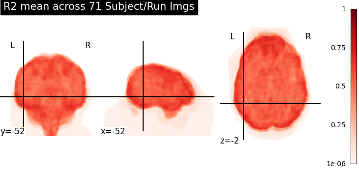

#### Voxelwise Variance (Standard Deviation)
The **standard deviation** (or variance) image provides insights into the variability of model performance.In otherwords, across subjects, runs and/or sessions, how much variability there is in the models ability to explain the BOLD at a given voxel.

#### Flagged Subjects
The quality assessment pipeline evaluates volumetric data across multiple dimensions to identify problematic datasets. Subjects are flagged using: 

  - Dice Estimate: Similarity coefficient between subject r-squared maps and Target Space MNI152 mask falls below .80 (captures dropout and excess non-brain voxels) 
  - Voxels Outside of Mask: Percentage of voxels outside of the target brain mask is greater than the .10% (liberal threshold due to liberal brain masks in fMRIPrep BOLD, captures mostly non-brain voxels) 

The subjects flagged for objectviewing are:
sub-4_run-1, sub-4_run-2, sub-4_run-3, sub-4_run-4, sub-4_run-5, sub-4_run-6, sub-4_run-7, sub-4_run-8, sub-4_run-9, sub-6_run-1, sub-6_run-10, sub-6_run-11, sub-6_run-12, sub-6_run-2, sub-6_run-3, sub-6_run-4, sub-6_run-5, sub-6_run-6, sub-6_run-7, sub-6_run-8, sub-6_run-9

The distribution for subjects and runs in objectviewing are below. 

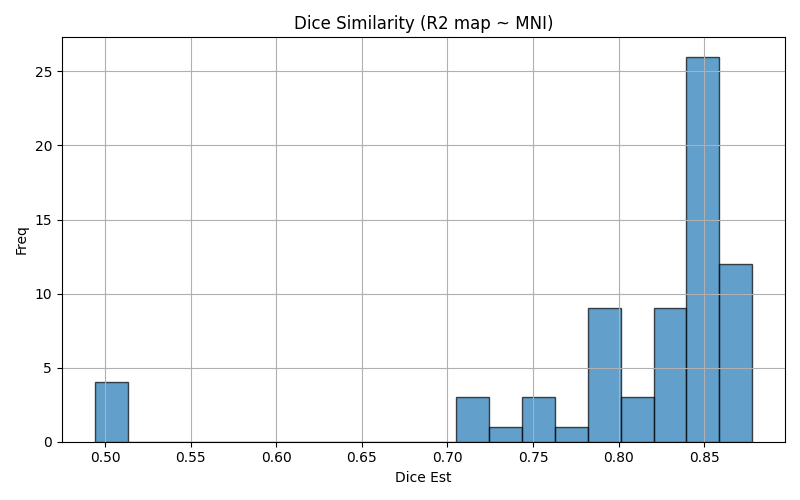

### Statistical Maps

#### shoe

#### house
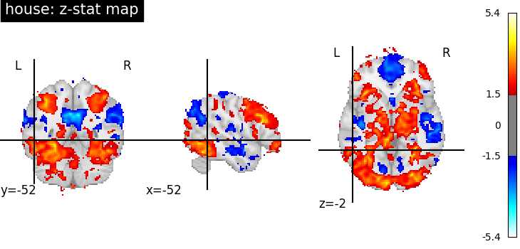

#### chair
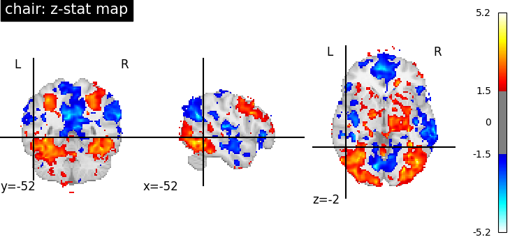

#### cat

#### face
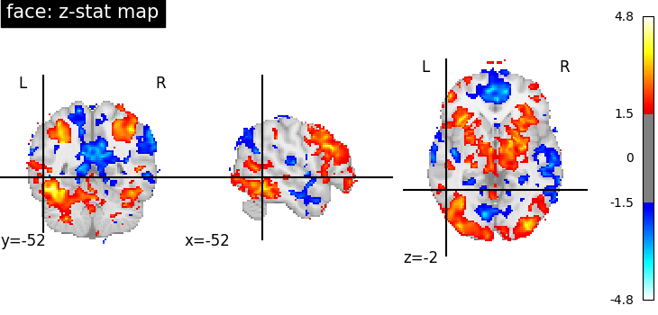

#### scrambledpix
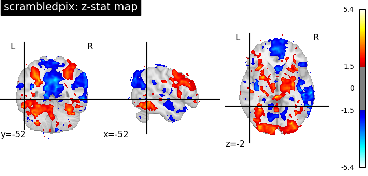

#### bottle
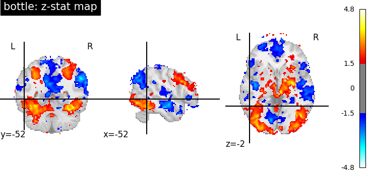

#### scissors
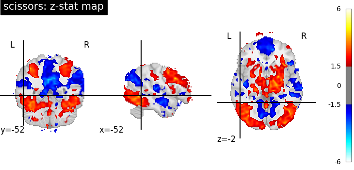

#### shoevscrambpix

#### housevscrambpix

#### chairvscrambdpix
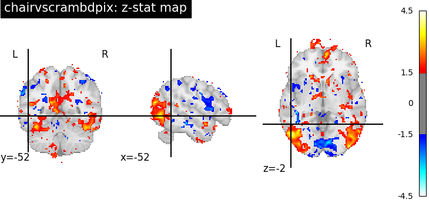

#### catvscrambpix

#### facevscrambpix

#### bottlevscrambpix
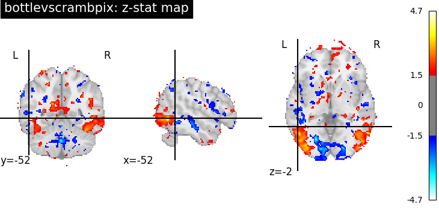

#### scissorsvscrambpix

#### shoevhouse
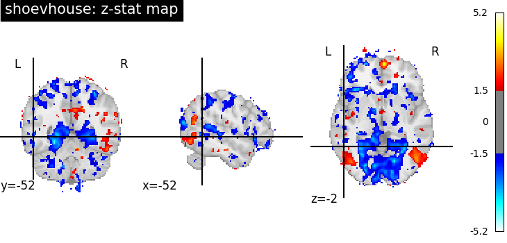

#### shoevchair

#### shoevcat
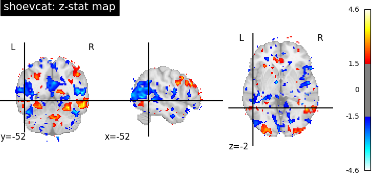

#### shoevface
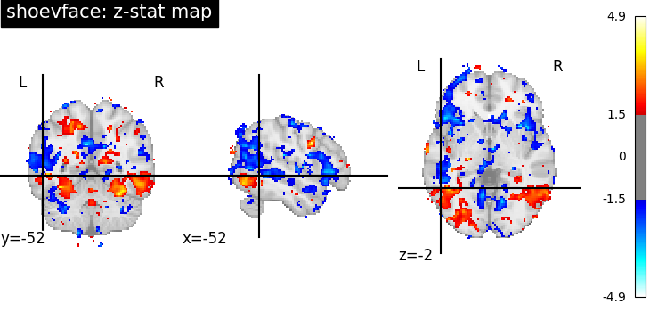

#### shoevbottle

#### shoevsscissors

#### housevchair

#### housevcat
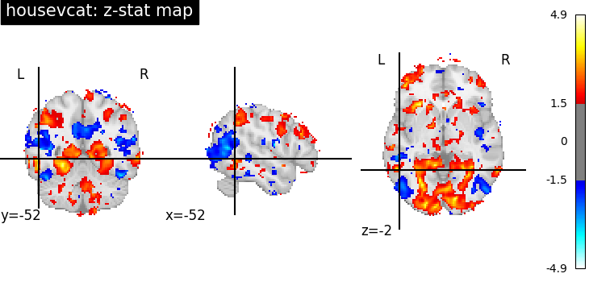

#### housevface

#### housevbottle
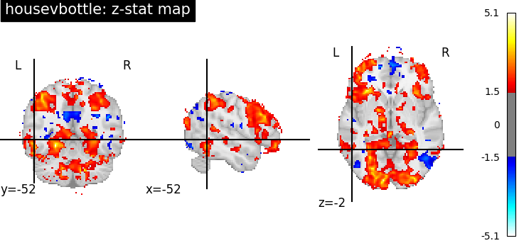

#### housevsscissors

#### chairvcat

#### chairvface
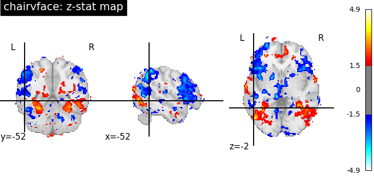

#### chairvbottle

#### chairvsscissors
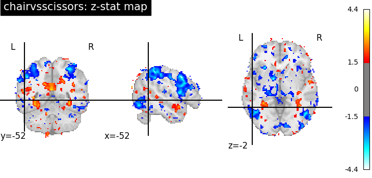

#### catvface

#### catvbottle

#### catvsscissors
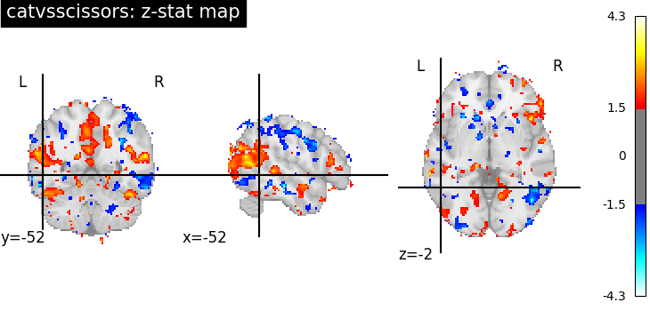

#### facevbottle
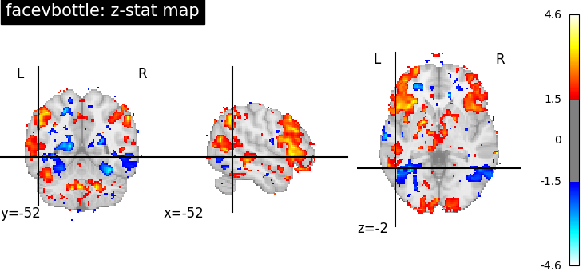

#### facevsscissors

#### bottlevsscissors
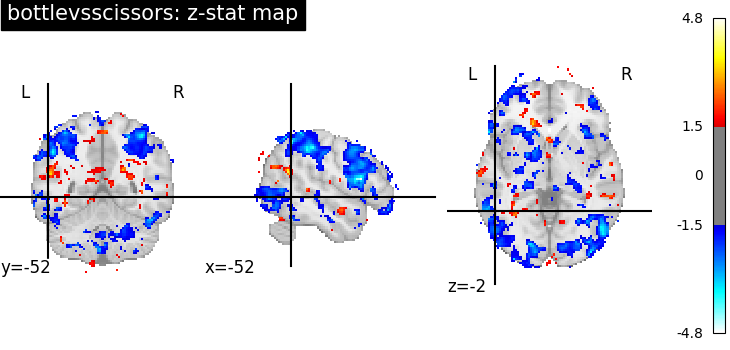
