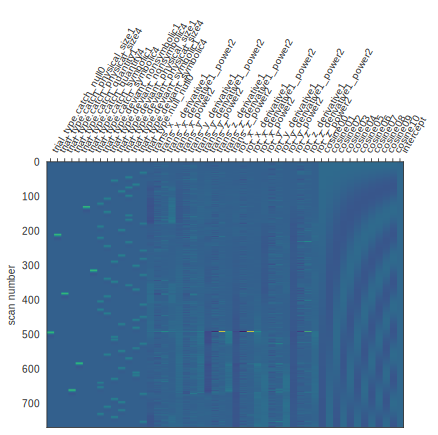
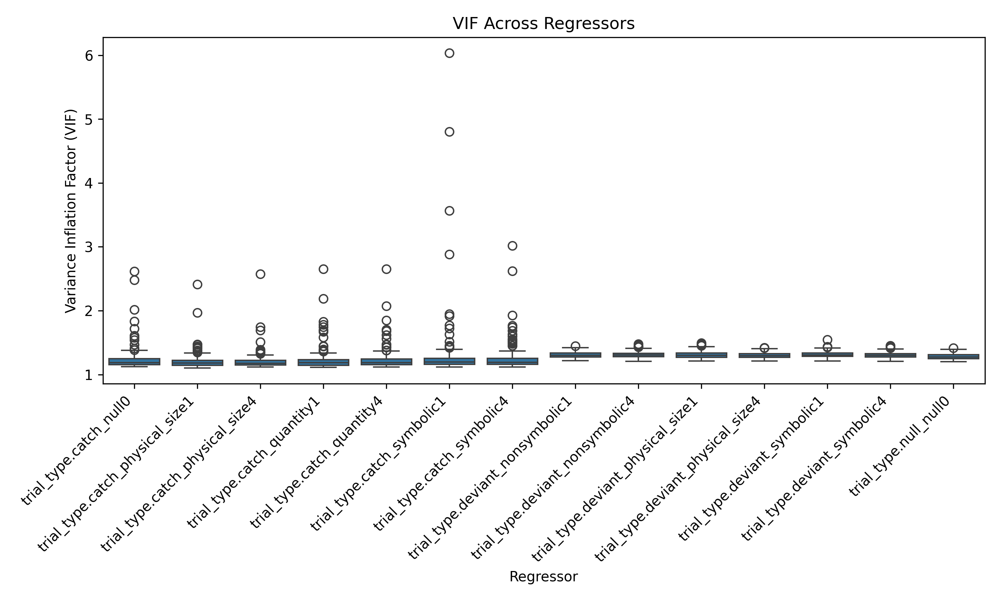
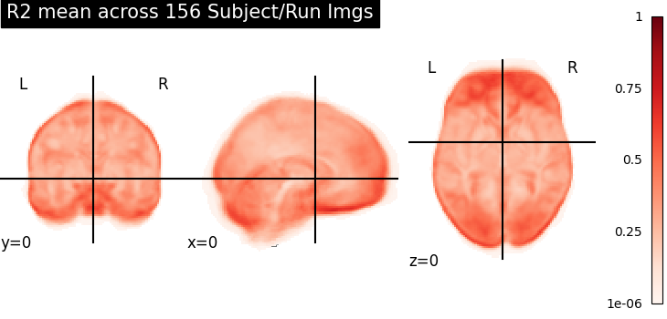
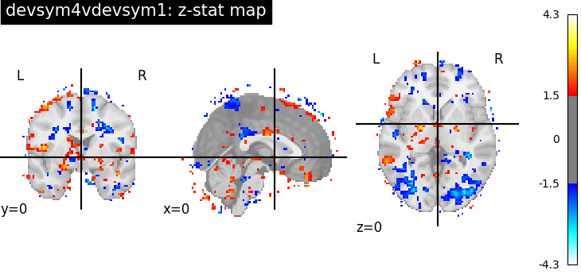
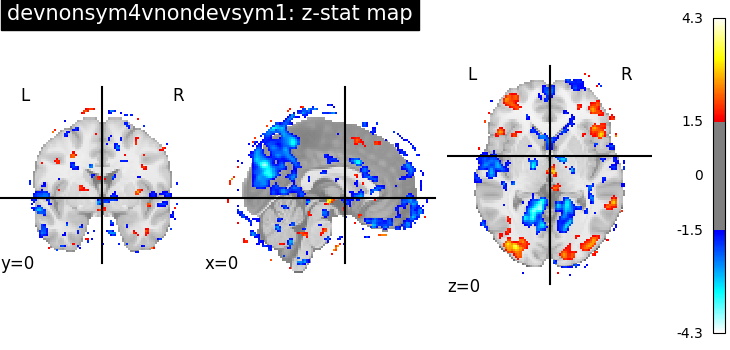
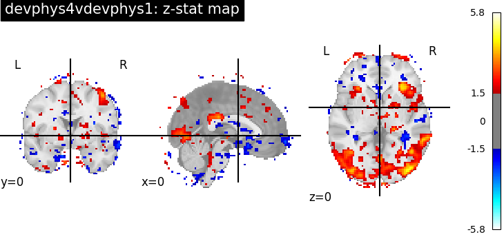
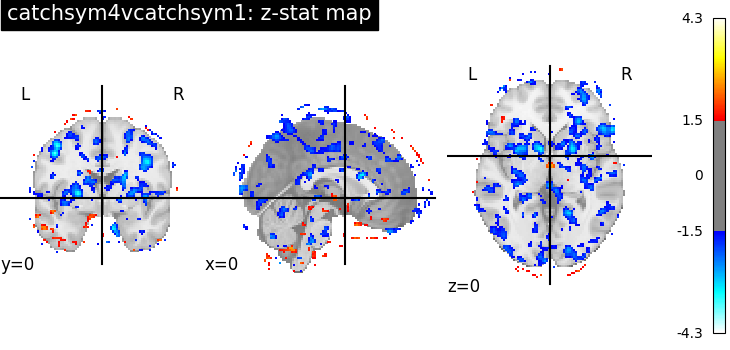
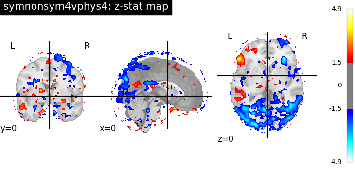
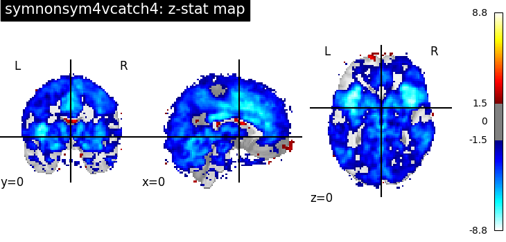
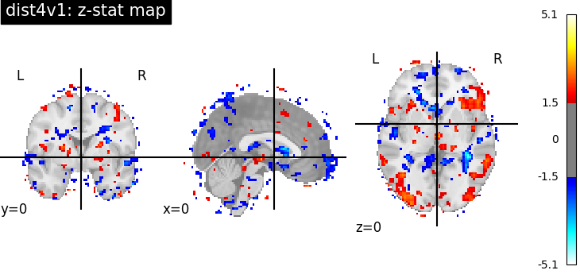

# ds001848: ParallelAdaptation Task Analysis Report
## Analysis Overview
Subject-level models were fit for 52 subjects performing the ParallelAdaptation task.
HRF model type: spm. Data were smoothed at each run using a 5mm FWHM (default: isotropic additive smoothing)
### Regressors of Interest
trial_type.catch_null0, trial_type.catch_physical_size1, trial_type.catch_physical_size4, trial_type.catch_quantity1, trial_type.catch_quantity4, trial_type.catch_symbolic1, trial_type.catch_symbolic4, trial_type.deviant_nonsymbolic1, trial_type.deviant_nonsymbolic4, trial_type.deviant_physical_size1, trial_type.deviant_physical_size4, trial_type.deviant_symbolic1, trial_type.deviant_symbolic4, trial_type.null_null0, intercept
### Nuisance Regressors
trans_x, trans_x_derivative1, trans_x_derivative1_power2, trans_x_power2, trans_y, trans_y_derivative1, trans_y_derivative1_power2, trans_y_power2, trans_z, trans_z_derivative1, trans_z_derivative1_power2, trans_z_power2, rot_x, rot_x_derivative1, rot_x_derivative1_power2, rot_x_power2, rot_y, rot_y_derivative1, rot_y_derivative1_power2, rot_y_power2, rot_z, rot_z_derivative1, rot_z_derivative1_power2, rot_z_power2, cosine00, cosine01, cosine02, cosine03, cosine04, cosine05, cosine06, cosine07, cosine08, cosine09, cosine10
## Model Structure
- Run-level models: Yes
- Subject-level models: Yes

The run-wise contrast estimates for each subject are averaged using a fixed-effects model.
## Contrasts of Interest
- **devsym4vdevsym1**: ['1 * `trial_type.deviant_symbolic4` - 1 * `trial_type.deviant_symbolic1`']
- **devnonsym4vnondevsym1**: ['1 * `trial_type.deviant_nonsymbolic4` - 1 * `trial_type.deviant_nonsymbolic1`']
- **devphys4vdevphys1**: ['1 * `trial_type.deviant_physical_size4` - 1 * `trial_type.deviant_physical_size1`']
- **catchsym4vcatchsym1**: ['1 * `trial_type.catch_symbolic4` - 1 * `trial_type.catch_symbolic1`']
- **symnonsym4vphys4**: ['1 * `trial_type.deviant_symbolic4` + 1 * `trial_type.deviant_nonsymbolic4` - 2 * `trial_type.deviant_physical_size4`']
- **symnonsym4vcatch4**: ['1 * `trial_type.deviant_symbolic4` + 1 * `trial_type.deviant_nonsymbolic4` - 2 * `trial_type.catch_symbolic4`']
- **dist4v1**: ['1 * `trial_type.deviant_symbolic4` + 1 * `trial_type.deviant_nonsymbolic4` + 1 * `trial_type.deviant_physical_size4` - 1 * `trial_type.deviant_symbolic1` - 1 * `trial_type.deviant_nonsymbolic1` - 1 * `trial_type.deviant_physical_size1`']

## Figures

### Contrast Weights

The contrast maps represents the weights used to model brain activity.

### Design Matrix

The example design matrix illustrates the model used in the statistical analyses for this task (Note: if motion outliers are included, the number of these will vary between subjects). Each column represents a regressor (of interest or not of interest, based on the above), and each row represents a time point in the BOLD timeseries. The colored patterns show how different experimental conditions are modeled across the scan duration (HRF model).

### Variance Inflation Factor (VIF)

The Variance Inflation Factor (VIF) boxplot quantifies multicollinearity between model regressors. Lower VIF values indicate more statistically independent regressors, which is desirable for reliable parameter estimation. VIFs were estimated using the first-level model design matrices -- nusiance regressors are excluded here for brevity.

### Voxelwise Model Variance Explained (r-squared)
Voxelwise R-squared values represent the proportion of variance explained by the model at each voxel in the brain. The R-squared images shown here are calculated across runs, subjects and/or sessions (dependent on data Fitlins nodes) for the study and task.

#### Voxelwise Average (Mean)
The **mean** R-squared image reflect the average of the R-squared values across all subjects and runs.In other words, the fluctuation in how much variability in the BOLD signal the model explains at a given voxel.

#### Voxelwise Variance (Standard Deviation)
The **standard deviation** (or variance) image provides insights into the variability of model performance.In otherwords, across subjects, runs and/or sessions, how much variability there is in the models ability to explain the BOLD at a given voxel.

### Statistical Maps

#### devsym4vdevsym1

#### devnonsym4vnondevsym1

#### devphys4vdevphys1

#### catchsym4vcatchsym1

#### symnonsym4vphys4

#### symnonsym4vcatch4

#### dist4v1

