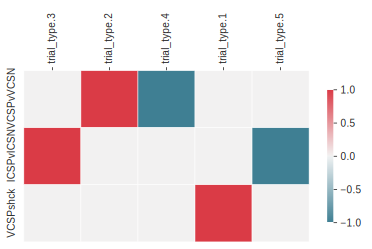
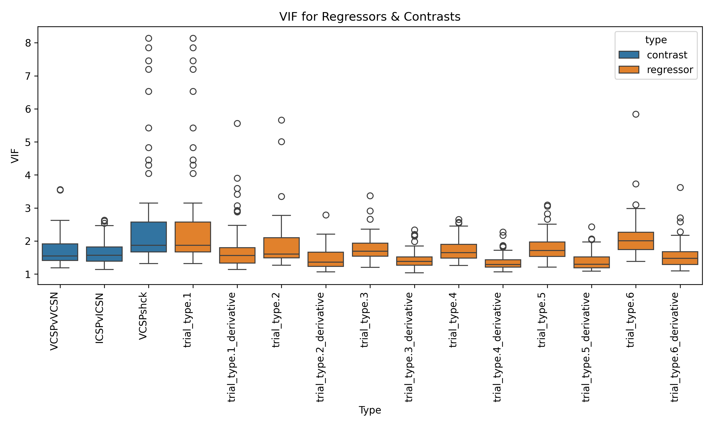
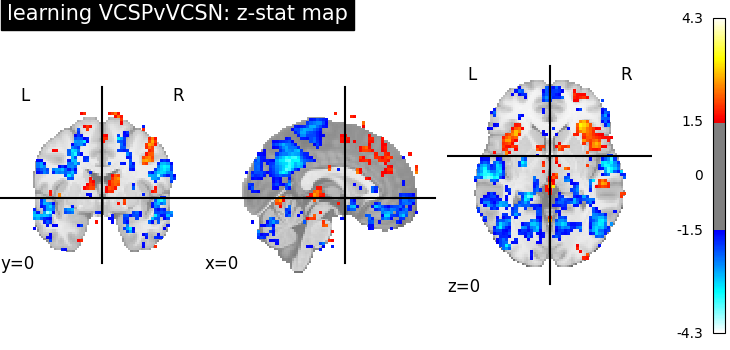
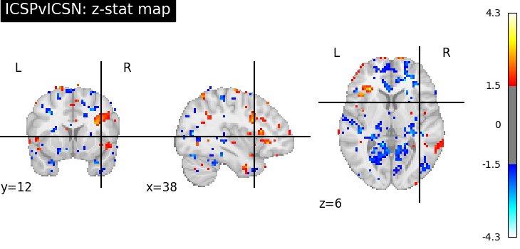
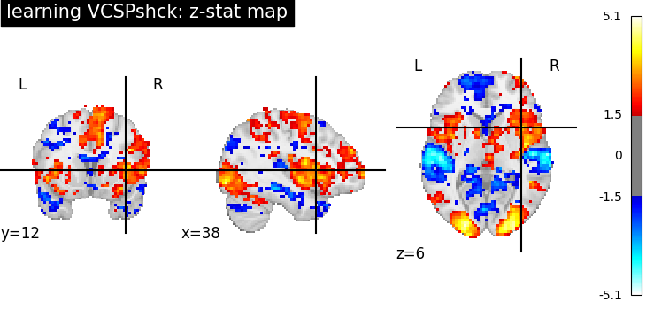

# ds003425: learning Task Analysis Report
## Analysis Overview
Subject-level models were fit for 13 subjects performing the learning task.
HRF model type: spm
### Regressors of Interest
trial_type.1, trial_type.1_derivative, trial_type.2, trial_type.2_derivative, trial_type.3, trial_type.3_derivative, trial_type.4, trial_type.4_derivative, trial_type.5, trial_type.5_derivative, trial_type.6, trial_type.6_derivative, intercept
### Nuisance Regressors
trans_x, trans_x_derivative1, trans_x_derivative1_power2, trans_x_power2, trans_y, trans_y_derivative1, trans_y_derivative1_power2, trans_y_power2, trans_z, trans_z_derivative1, trans_z_derivative1_power2, trans_z_power2, rot_x, rot_x_derivative1, rot_x_derivative1_power2, rot_x_power2, rot_y, rot_y_derivative1, rot_y_derivative1_power2, rot_y_power2, rot_z, rot_z_derivative1, rot_z_derivative1_power2, rot_z_power2, cosine00, cosine01
## Model Structure
- Run-level models: Yes
- Subject-level models: Yes

The run-wise contrast estimates for each subject are averaged using a fixed-effects model.
## Contrasts of Interest
- **VCSPvVCSN**: ['1 * `trial_type.2` - 1 * `trial_type.4`']
- **ICSPvICSN**: ['1 * `trial_type.3` - 1 * `trial_type.5`']
- **VCSPshck**: ['1 * `trial_type.1`']

## Figures

### Contrast Maps

### Variance Inflation Factor (VIF)

### Statistical Maps

#### VCSPvVCSN

#### ICSPvICSN

#### VCSPshck

